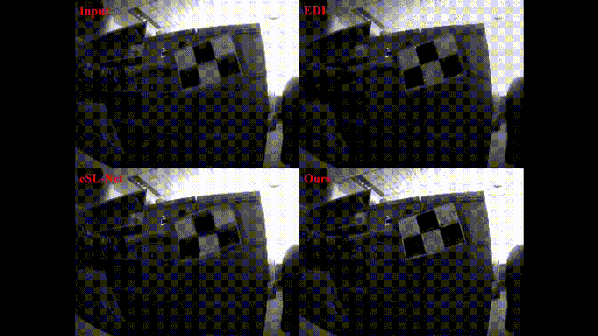

# NEST

**NEST: Neural Event Stack for Event-based Image Enhancement**, ECCV 2022

[Minggui Teng](https://tengminggui.cn/), Chu Zhou, Hanyue Lou, and [Boxin Shi](https://ci.idm.pku.edu.cn/).

Code coming soon!
___
## Examples of HFR video generation application
### Synthetic data

### Real data

## Contact
If you have any questions, please send an email to minggui_teng@pku.edu.cn