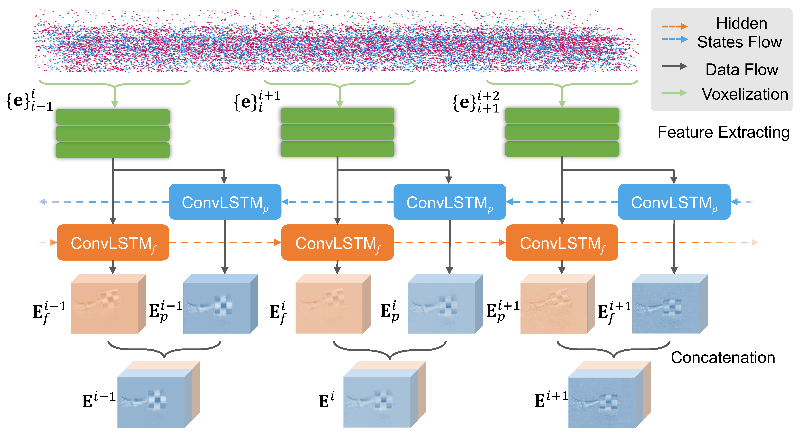

# **NEST: Neural Event Stack for Event-based Image Enhancement**, ECCV 2022

[Minggui Teng](https://tengminggui.cn/), Chu Zhou, Hanyue Lou, and [Boxin Shi](https://ci.idm.pku.edu.cn/).



___


## Dependency

```shell
pip install -r requirements.txt
```

## Train

### Deblur
```shell
python train.py --mode deblur --TrainImgPath `Path of Train Image` --TrainEvePath `Path of Events` --TrainGTPath `Path of Ground Truth Image`
```
### SR
```shell
python train.py --mode sr --upsample_scale 4 --TrainImgPath `Path of Train Image` --TrainEvePath `Path of Events` --TrainGTPath `Path of Ground Truth Image`
```

## Test
Pretrained model can be download in [PKU Disk](https://disk.pku.edu.cn:443/link/D94BD74A303AEFE04619BAC6917A09B7) or [Google Drive](https://drive.google.com/drive/folders/1_YKeGthyEPXYJtejYuEyHYlYtwo8y47u?usp=sharing), and copy to `pretrained` file folder.

### Deblur
```shell
python test.py --mode deblur --ckp pretrained/model_deblur_best.pth --TestImgPath demo_input/blur --TestEvePath demo_input/events
```
### SR
```shell
python test.py --mode sr --upsample_scale 4 --ckp pretrained/model_sr_best.pth --TestImgPath demo_input/lr --TestEvePath demo_input/events
```

configurations can be changed in `utils/options.py`

## Examples of HFR video generation application


More visual results are in the subfolder `demo`.


## Contact
If you have any questions, please send an email to minggui_teng@pku.edu.cn